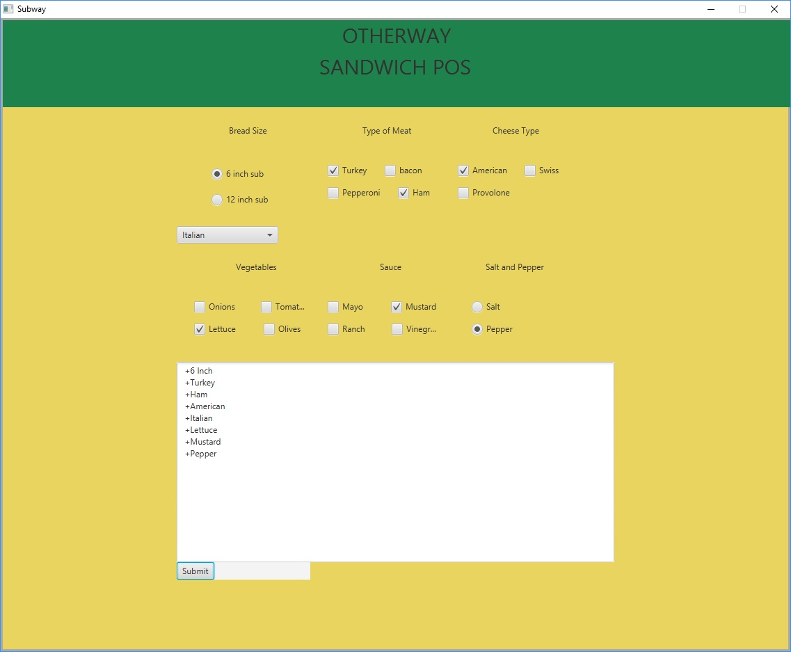

# Subway Ordering System

This project was done for our Java II class. This program prompts the user to complete a Subway ordering POS system.

## Example Output



## Analysis Steps

For the Subway Ordering POS, the user must choose from various sandwich variables. The variables consist of length of
sandwich, type of bread, vegetables, sauces, salt/pepper, and meat. When a user clicks "Submit" it displays their order
at the bottom of the program showing everything they chose. It pseudos sending it to the business and showing what they ordered.
There is also a "Clear" button that clears everything that is chosen.

### Design

The design was simple. We wanted the program to be very black and white to make the users interaction very straight forward and friendly. For the code, we used different methods within the same class to differentiate between the different groups (Cheeses, meats, bread, etc.).


public void pepperNsalt(){  

        saltPepper.getChildren().addAll(lblPepperSalt, salt, pepper);  //adding objects to vbox saltPepper
        saltPepper.getStyleClass().add("sp");  //add class for css for saltPepper
        lblPepperSalt.setPadding(new Insets(25,0,0,65));  //set padding for lblPepperSalt
        salt.setPadding(new Insets(25,0,0,45));  //set padding for radio button salt
        pepper.setPadding(new Insets(0,0,0,45));  //set padding for radio button pepper
        
        salt.selectedProperty().addListener(new ChangeListener<Boolean>() {  //add listener to radio button salt
            @Override
            public void changed(ObservableValue<? extends Boolean> observable, Boolean oldValue, Boolean newValue) {
                // TODO Auto-generated method stub
                if(newValue){
                    order.add( " +Salt ");  //adds string to order
                }
            }
        });
       pepper.selectedProperty().addListener(new ChangeListener<Boolean>() { //add listener to radio button pepper
            @Override
            public void changed(ObservableValue<? extends Boolean> observable, Boolean oldValue, Boolean newValue) {
                // TODO Auto-generated method stub
                if(newValue){
                    order.add(" +Pepper "); //add string to order
                }
            }
        });
    }

### Testing

Testing was mostly the program, seeing how the program was laying out and seeing if we could get it to display. We would make changes, start the program, and make changes where necessary.

`

## Notes

One of the first issues we came across was the margins. We couldn't figure out why different columns were getting pushed around and making the styling look different. We then were told it was the columns that were getting larger and not set at an initial size to incorporate all of the radio buttons and check boxes.

Another major issue that we had was that we couldn't figure out how to display one string as our output. We googled and googled until we finally figured out that our issue was that we needed a foreach loop that went through the array and added spaces to each element to display it.
```
Anthony, put the code for the foreach loop here
```
We all worked together in class to get the project done. Anthony did some of the framework at home on his own, which really sped things up in class. We were able to collaborate together, fix bugs, and complete the Subway Ordering POS.

## Adapted from a README Built With

* [Dropwizard](http://www.dropwizard.io/1.0.2/docs/) - The web framework used
* [Maven](https://maven.apache.org/) - Dependency Management
* [ROME](https://rometools.github.io/rome/) - Used to generate RSS Feeds
us.

## Acknowledgments And Developers

* Renee Riley CIS 171 Instructor
* ANTHONY TENNENBAUM
* ETHAN TREECE
* JUSTIN MANGAN
